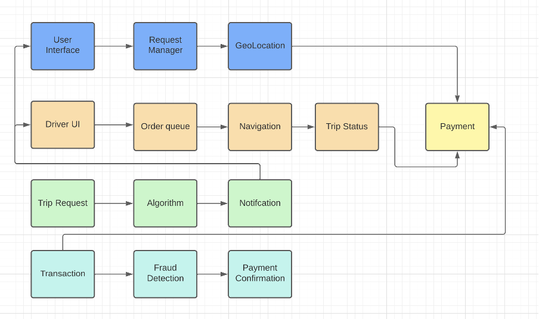

## Homework 4

Mateo Ruiz
Martín Navarro
Luis Cagigal

### Information Security

### Instructions:

For this homework, you will work in groups of 5 people. You are expected to include with your submission the following details:

1. A URL to the GitHub page containing your group's assignment
2. Each member of the team will submit a grade (0 to 100) for the team members based on the amount of work that each member contributed

### 1. Design the system components of a drive sharing application (ex: Uber, Lyft). Specify what elements are necessary for this application to work. 

Your design must include a block diagram of each of the components to have the application needs to operate.

In your design, you must provide a list of the data that you need to collect for the operation of the application. For each, provide a description of why you need this data. Examples:
    - who are the users of your application? what kind of information do you need of each of them?
    - what data do you need to make the user experience better? Examples: better ride experience, shorter wait time, faster routes, etc
    - what kind of data do you need to collect to measure the performance and efficiency of the application? 
    - what about payment and tipping?

There are two kinds of users for our application.

**User (Passenger)**:

For the first user which will be the passager we will need the following information:

- Basic User Information: (Name, email, phone number, profile picture and payment method). Important for identification and account management.

- Trip Information: Origin, destination, vehicle preference. Important for booking rides and showing ride info.

- Payment information: Billing address, credit card details. Important for payment gateway (Secure)

- Rating and feedback: Rating from other drivers and overall trip experience. Important to improve quality service.

**Driver**

- Basic Driver Information:(Name, email, phone number, profile picture, license plate, rating). Important for driver availability and identification.

- Availability and location: Ride status and real time location. Important for ride matching efficiency.

- Trip information: Route, passenger information. Important for constant ride tracking, ensures safety in users and drivers.

- Payment history: Track revenue and manage payouts. Important for all billing systems.

- Driver scoring system: To generate user's trust based on ratings. Important for trust in the application.

**Data for UX:**
- User-side:
    - Location (For routing purposes and service optimization)
    - Trip requests (as well as cancelling trips, changing settings, driver data)
    - Preferences (Payments, contacts, etc.)
    - Basic data (Contact information)
    - Trip times (ETA according to traffic data)
- Driver-side:
    - Trip requests (User's data, locations, destinations)
    - Preferences (Accepting and declining trip requests)
    - Basic data (Contact information)
    - Trip payment based on ETA

All these are important to keep the users notified, alert, and so they can keep track of everything surrounding their trip.

**Data for Performance and Efficiency**
- Scoring system (for both users and drivers)
- Succesful trips (based on positive ratings), analyzing routes taken and fees
- App Store and Google Play Store scores
- Estimated times for:
    - Requesting and accepting rides
    - Traveling times
    - Wait times for accepted times
    - Wait times for drivers when reaching ride starting points
- Rate of rides cancelled (pre-trip or during trip)
- Most common ride-requesting areas analysis

All these are necessary for a correct estimation of how efficient and trustful the application is.

**Payment and Tipping**
- Billing information:
    - Important for every transaction made within the app, includes credit card details, names, addresses, etc.
- User data:
    - Both drivers and users must know exactly who they are working with, so they believe they are safe during trips, and can take measures if things fail.
- Trip information:
    - All payments and tipping are based on ride details, distances, ETAs, traffic, demand, etc.

_____

Include a privacy design for the application. 

- For all the data that is being collected, what can be seen and by whom? 

**Admin:**

All user data, including regular users and drivers, including contact information and location data. Billing information should be managed with a 3rd party system, so admins don't have access to it but have a way to validate them for payment purposes.

**User:**

Driver contact information, driver location and trip fees. (only during trips)

**Driver:**

User contact information, ride destination, user's location, payment details (NOT user's billing information), ride fees (only during trips).

- What information should have restricted access? 

Personal details should be limited, only necessary details should be provided, like names and locations. Other than that, user's details must remain limited. Both for dirvers and users.
Admins should have access to all of the information for user management purposes.
All trip details should be limited as well, only the users involved and drivers involved should be able to see trip details, including locations. Other users shouldn't have access to location data, unless they're involved in the same trip.

- What information should not be seen by anyone?

ALL billing information should be handled by an external platform only for validation purposes, no credit card info should be available to anyone, not even admins.

_____

Assume you are a pen-tester and you are in charge of testing the privacy design proposed.
    
- What are the risks if you are able to get access to the app as a user, as an admin, and as developer?

If you gain user access, you shouldn't be able to do much with the information available to you, so you should probably look for a way to escale your privileges. The information available to you is very limited. If you gain access as a driver user, then you could catfish someone, which is a dangerous risk.

If you gain developer access, you should be able to access databases filled with user and driver information. So it is very dangerous, since you can sell that data to other systems, including user personal information, names and addresses included.

If you gain admin access, you are in control of every piece of data in the app. Including all developer data mentioned before, as well as billing information available to you, if you manage to connect the validation software with the user data. This case presents the most risks, since you can even modify user data and have access to sensitive aspects of the application.

- In any of these cases, what are the ways that an attacker can provoke a privacy breach? What kind of attacks can be used to accomplish this.

A man in the middle attack should be simple enough to gain access for each of the privileges determined before. But you need to be able to target admin and developer users before the attack itself. SQL injection may be possible if you have access to the database queries. Phishing approachs should be good entrance attacks, but you need to target high-privileged users as mentioned before.

- Write an ethical analysis of the consequences of a privacy breach of the app for each of the cases above. 

**Privacy breach for Users**

Consequences:

Among the consequences of a privacy breach for users (passengers):
- Exposure of personal information, such as name, travel history, etc.
- Possible misuse of location data, exposing the passenger's integrity
- Violation of trust in the travel service.

Ethical Implications:

- Violation of user privacy
- Security concern regarding potential misuse of location data, affecting the user's physical safety
- Potential harm due to the exposure of sensitive data

**Privacy breach for Drivers**

Consequences:

Among the consequences of a privacy breach for drivers:
- Disclosure of personal details, such as contact and location
- Potential damage to the driver's reputation
- Financial risks if payment and billing details are compromised

Ethical Implications:

- Violation of trust in the platform and its drivers
- Financial losses, actions that can lead to the loss of livelihood for drivers
- Damage to the reputation of drivers

**Privacy breach for Administrators:**

Consequences:

- Unauthorized access to user and driver information
- Unauthorized manipulation of information

Ethical Implications:

- Violation of user and platform administrator trust
- Possibility of unauthorized data modifications
- Financial and reputational damage to the platform

**Ethical Analyisis:**

Autonomy and user control: Users have the right to control their information and decide how it is used.

Transparency and responsibility: Platforms must be transparent about data usage and are responsible for safeguarding user information.

Security and well-being: Breaches compromising user and driver security have direct ethical implications. The platform must prioritize the security and well-being of its users.

Mitigation and resolution: Ethical responsibility extends to the platform's response to a breach. Quick and effective mitigation measures, along with transparent communication, are essential to address the consequences of a breach.

### 2. Your drive sharing company has decided to sell users data to advertisers. 

You have been asked to loosen up your design so that data can be sold to advertisers. Additionally, your manager has asked you to provide a list of data that can be sold, so the advertisers can maximize the accuracy of the ads. 

**Alternative Desgin**

The design of the platform should be similar to the one presented in point 1. But there are some major changes that need to be made in order to approve the selling of some data for advertising purposes:
- First, there needs to be an approved advertising mechanism, which could be software adaptation to show ads in certain parts of the screen, or partnership with companies that can provide personalized ads according to users.
- Second, advertising users cannot be allowed to access all of the user's data. More of that explained at the **data for advertising purposes list**.
- Third, there needs to be some kind of assurance that advertising won't affect any of the app's functionality and confidentiality.

**Data for Advertising Purposes (List)**

1. Limited user data:
    - Emails and phone numbers (only if the user is ok for that data to be shown)
    - Frequently visited places, based on trip destinations
2. Limited driver data:
    - Emails and phone numbers (only if driver is ok for that data to be shown)
3. Location data (for drivers and users):
    - Only for 'places near you' type of recommendations and advertisement
_____

Provide the details of the new privacy design following the same principles you used for the original design.

**Admin:**

All user data, including regular users and drivers, including contact information and location data. Billing information should be managed with a 3rd party system, so admins don't have access to it but have a way to validate them for payment purposes. Admins also should be able to determine which kind of data is being accessed by advertiser users.

**User:**

Driver contact information, driver location and trip fees. (only during trips). Advertisement data, determined by advertisers.

**Driver:**

User contact information, ride destination, user's location, payment details (NOT user's billing information), ride fees (only during trips). Advertisement data, determined by advertisers.

**Advertisers:**

Limited user and driver data, only based in emails and phone numbers. Location data should be limited as well, by being only shown according to fixed destinations (real-time locations should NOT be sold). 

- What information should have restricted access? 

Personal details should be limited, only necessary details should be provided, like names and locations. Other than that, user's details must remain limited. Both for dirvers and users.
Admins should have access to all of the information for user management purposes. Advertisers should only be able to access limited contact information, and limited location information (specified in the previous point).
All trip details should be limited as well, only the users involved and drivers involved should be able to see trip details, including locations. Other users shouldn't have access to location data, unless they're involved in the same trip. Advertisers neither should have access to specific trip information.

- What information should not be seen by anyone?

ALL billing information should be handled by an external platform only for validation purposes, no credit card info should be available to anyone, not even admins, and even less advertisers.

______

Repeat the pen-tester exercise done for the original design. 

- What are the risks if you are able to get access to the app as a user, as an admin, and as developer?

If you gain user access, you shouldn't be able to do much with the information available to you, so you should probably look for a way to escale your privileges. The information available to you is very limited. If you gain access as a driver user, then you could catfish someone, which is a dangerous risk.

If you gain developer access, you should be able to access databases filled with user and driver information. So it is very dangerous, since you can sell that data to other systems, including user personal information, names and addresses included. For this new case, you could also access advertisers' information, which could endanger the reputation with ad management services and the platform.

If you gain admin access, you are in control of every piece of data in the app. Including all developer data mentioned before, as well as billing information available to you, if you manage to connect the validation software with the user data. This case presents the most risks, since you can even modify user data and have access to sensitive aspects of the application. Now, you can also control the amount of data that is shown to advertisers, so they can gain access to sensitive information which should be able to be seen by them.

- In any of these cases, what are the ways that an attacker can provoke a privacy breach? What kind of attacks can be used to accomplish this.

A man in the middle attack should be simple enough to gain access for each of the privileges determined before. But you need to be able to target admin and developer users before the attack itself. SQL injection may be possible if you have access to the database queries. Phishing approachs should be good entrance attacks, but you need to target high-privileged users as mentioned before.

- Write an ethical analysis of the consequences of a privacy breach of the app for each of the cases above. 

**Privacy breach for Users**

Consequences:

Among the consequences of a privacy breach for users (passengers):
- Exposure of personal information, such as name, travel history, etc.
- Possible misuse of location data, exposing the passenger's integrity
- Violation of trust in the travel service.

Ethical Implications:

- Violation of user privacy
- Security concern regarding potential misuse of location data, affecting the user's physical safety
- Potential harm due to the exposure of sensitive data

**Privacy breach for Drivers**

Consequences:

Among the consequences of a privacy breach for drivers:
- Disclosure of personal details, such as contact and location
- Potential damage to the driver's reputation
- Financial risks if payment and billing details are compromised

Ethical Implications:

- Violation of trust in the platform and its drivers
- Financial losses, actions that can lead to the loss of livelihood for drivers
- Damage to the reputation of drivers

**Privacy breach for Administrators:**

Consequences:

- Unauthorized access to user and driver information
- Unauthorized manipulation of information

Ethical Implications:

- Violation of user and platform administrator trust
- Possibility of unauthorized data modifications
- Financial and reputational damage to the platform

**Privacy breach for Advertisers:**

Consequences:

- Unauthorized access to advertiser information
- Unauthorized access to data handled by advertisers

Ethical Implications:

- Violation of advertisers trust, may result in cuts in funding
- Manipulation in user data, managed by advertisers including leaks and database selling
- Reputational damage for the platform in general

______

Write an ethical analysis of the consequences of selling this data to adverstisers.

Consequences:

- Disclosure of personal information: Users and drivers may feel betrayed by the exposure of their personal information.
- Potential for intrusive advertising: Users may experience a privacy invasion; advertisers may use the information for spam.
- Possible advertising discrimination: There is a risk that shared information could be used to target ads in a discriminatory manner.

Ethical Implications:

Informed consent: Ethics requires users to provide informed consent before their data is shared with third parties; lack of transparency constitutes ethical violations.

Right to privacy: Data selling raises ethical questions about the right to privacy of users and drivers; they deserve to know how their data is used.

Equity in advertising: Advertising ethics demands equity and discourages discrimination, so data should not be used to perpetuate stereotypes or discrimination.

Transparency and trust: Transparency in the sale of compromised information is essential to maintain user trust. Hiding or minimizing data sales could be considered a violation of user trust.
